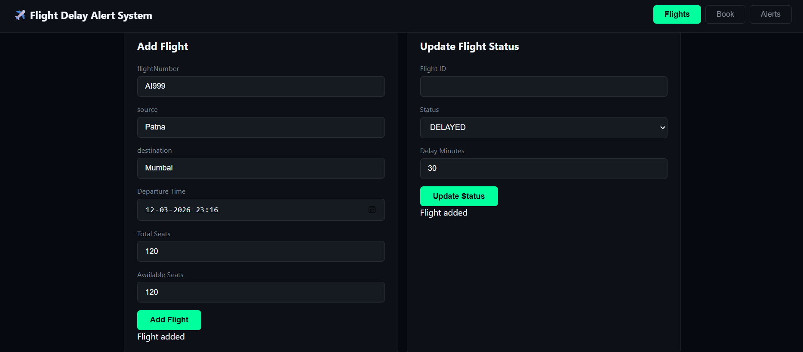
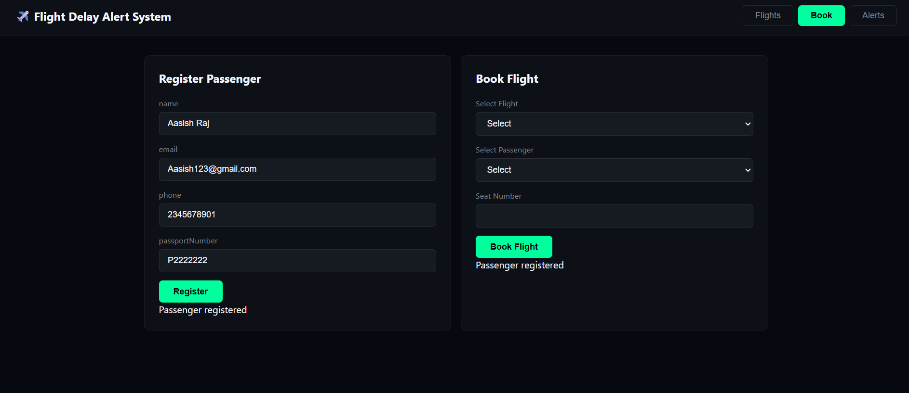
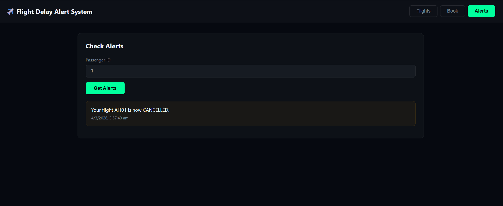

# ✈️ SkyTrack — Flight Delay Alert System

A production-grade React dashboard for real-time flight tracking and passenger delay alerts, consuming a Spring Boot REST API.

> Built by **Khushi Sharma** | Full Stack Developer | LNCT Bhopal

---

## 🔗 Repositories

| Layer | Repository |
|-------|-----------|
| Frontend | [skytrack-frontend](https://github.com/sharmakhushi18/skytrack-frontend) |
| Backend | [flight-delay-alert-api](https://github.com/sharmakhushi18/flight-delay-alert-api) — Spring Boot + MySQL + JPA |

---

## 🚀 Features

- 📊 **Live Stats Dashboard** — Total, On Time, Delayed, Cancelled flight counts
- ✈️ **Flight Management** — Add flights, update status, triggers auto alerts
- 🔍 **Search & Filter** — Filter by flight number, route, or status
- 🎫 **Smart Booking** — Only bookable flights selectable (ON_TIME, DELAYED, BOARDING)
- 👤 **Passenger Registration** — With email & seat format validation
- 🔔 **Real-time Alerts** — Passenger delay/cancellation notifications
- ⟳ **Auto Refresh** — Flights update every 30 seconds silently
- 🍞 **Toast Notifications** — Success, error, info feedback
- 💀 **Skeleton Loading** — Shimmer cards while data loads
- 📱 **Fully Responsive** — Works on mobile & desktop

---

## 🛠️ Tech Stack

| Technology | Usage |
|------------|-------|
| React 18 | Frontend framework |
| JavaScript ES6+ | Hooks, async/await, modules |
| CSS3 | Dark theme, animations, glassmorphism |
| Fetch API | REST API integration |
| Spring Boot | Backend (port 8080) |

---

## 🗂️ Project Structure

```
src/
├── components/
│   ├── Navbar.js        ← Header, tabs, refresh button
│   ├── FlightList.js    ← Flight cards, add/update flight
│   ├── BookingForm.js   ← Register passenger, book flight
│   ├── AlertList.js     ← Passenger alert lookup
│   └── StatusBadge.js   ← Reusable status pill component
├── services/
│   └── api.js           ← All API calls, base URL config
├── utils/
│   └── helpers.js       ← formatDate, STATUS_META, calcStats
├── App.js               ← Root, state, auto-refresh, toasts
├── App.css              ← Full dark theme styling
└── index.js             ← Entry point
```

---

## ⚙️ How to Run Locally

### Prerequisites
- Node.js v16+
- Spring Boot backend running on `http://localhost:8080`

### Steps

```bash
# Clone the repository
git clone https://github.com/sharmakhushi18/skytrack-frontend.git

# Navigate to project
cd skytrack-frontend

# Install dependencies
npm install

# Start the app
npm start
```

App runs at: `http://localhost:3000`

> Make sure backend is running at `http://localhost:8080` before starting frontend.

---

## 🔄 How It Works

```
User opens browser (localhost:3000)
        ↓
React fetches flights from Spring Boot API
        ↓
Stats, flight cards, search/filter rendered
        ↓
Auto-refresh every 30 seconds (silent)
        ↓
Status update → Backend auto-generates passenger alerts
        ↓
Passenger checks alerts via Passenger ID
```

---

## 🧠 Architecture Decisions

- **Component-based structure** — Each feature is an isolated, reusable component
- **Service layer** (`api.js`) — All fetch calls centralized, easy to swap base URL
- **Utility layer** (`helpers.js`) — `STATUS_META`, `BOOKABLE_STATUSES`, `formatDate` reused across components
- **Whitelist booking filter** — `["ON_TIME", "DELAYED", "BOARDING"]` — scalable, not exclusion-based
- **Separate loading states** — `registerLoading` and `bookingLoading` prevent UI conflicts
- **Silent auto-refresh** — No loading flash on background updates

---

## 📸 Screenshots

### Flights Dashboard


### Book Flight


### Passenger Alerts


---

## 👩‍💻 Author

**Khushi Sharma**
- GitHub: [@sharmakhushi18](https://github.com/sharmakhushi18)
- Final Year ECE | LNCT Bhopal
